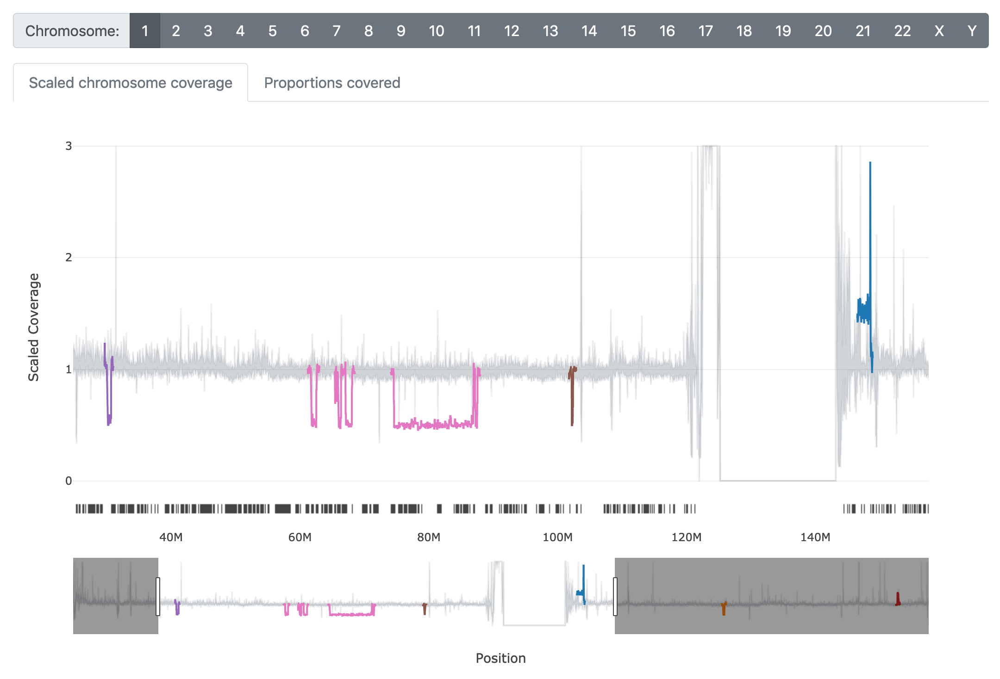
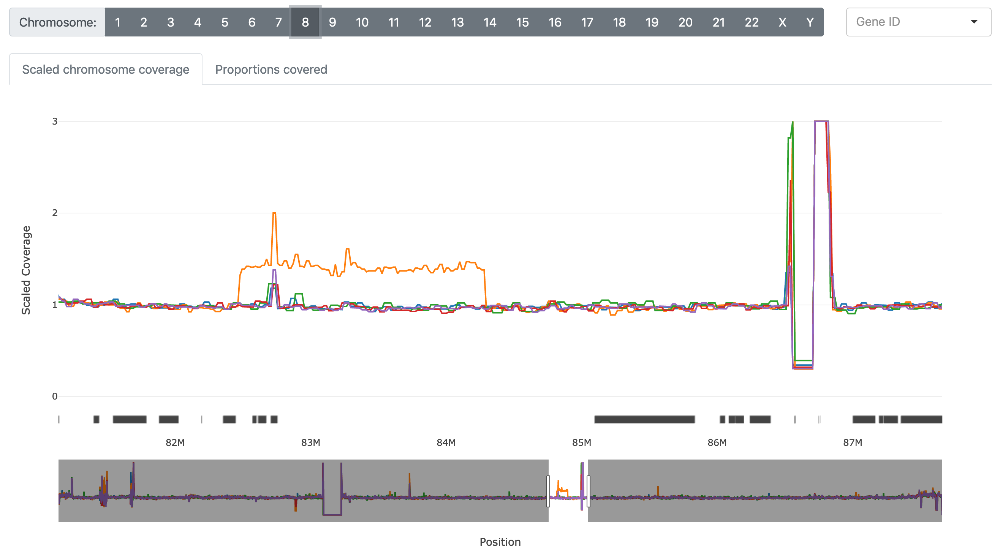
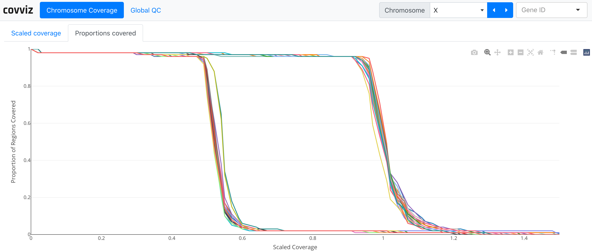

# covviz

Coverage visualization; a many-sample coverage browser.

The aim of `covviz` is to highlight regions of significant
(passing the user's z-score threshold) and sustained (beyond user specified
distance) deviation from the majority of samples. Significance is determined
using z-scores for all samples at all points using median absolute deviation,
but in order to be highlighted, points must be significant consecutively
throughout a user specified distance.

If you are analyzing a low number of samples, deviation may be irrelevant. In
this case, we can set `--min-samples` to be greater than our sample total
to skip Z-threshold calculation and plot coverages for all samples at all
points.

# The Python Package

`covviz` is installable via `pip install -U covviz`. It's currently quite
dependent upon `indexcov` output, but we're working to make this more
generalized -- to accept any bed input, normalize the coverage, and calculate
the ROC curves.

## Usage

To analyze your coverage data it needs to be in bed3+ format and include a
header with sample IDs. The first three column headers are agnostic, but
for samples test_sample1, test_sample2, and test_sample3, this would look like:

```
#chrom   start   end   test_sample1   test_sample2   test_sample3
```

Then CLI usage is:

```
covviz --ped $ped $bed $roc
```

### Custom Metadata (.ped)

There is support for non-indexcov .ped files, though you may have to change
the default column IDs pertaining to the column which contains the sample ID
and the sex of the sample.

```
covviz --ped $ped --sample-col sample_col --sex sex_col $bed $roc
```

# The Nextflow Workflow

If you're starting with alignment indexes, this workflow aims to simply the
process of obtaining coverage and generating the coverage browser.

We use [indexcov](https://github.com/brentp/goleft/tree/master/indexcov)
to quickly estimate the coverage across samples then find regions of large,
coverage-based anomalies.

The output of `indexcov` is then directly input into `covviz`.

## Usage

Install `nextflow`:

```
curl -s https://get.nextflow.io | bash
```

Full nextflow installation instructions are available at:
https://www.nextflow.io/

To simplify prerequisite software installations and software version tracking,
we strongly recommend running `covviz` using Docker or Singularity. Docker
installation instructions for your operating system are available at:
https://docs.docker.com/install/

Then, with Docker or Singularity we run:

```
nextflow run brwnj/covviz -latest -profile docker \
    --indexes 'data/indexes/*.crai' \
    --fai data/g1k_v37_decoy.fa.fai \
    --gff data/Homo_sapiens.GRCh37.82.gff3.gz
```

Which gives us `./results/covviz_report.html`.

### Required arguments

+ `--indexes`
    + quoted file path with wildcard ('*.crai') to cram or bam indexes
+ `--fai`
    + file path to .fai reference index
+ `--gff`
    + file path to gff matching genome build of `--indexes`

### Workflow Options

+ `--outdir`
    + output directory for results
    + default: "./results"
+ `--sexchroms`
    + sex chromosomes as they are in `--indexes`
    + default: "X,Y"
+ `--exclude`
    + regular expression of chromosomes to skip
    + default: "^GL|^hs|^chrEBV$|M$|MT$|^NC|_random$|Un_|^HLA\\-|_alt$|hap\\d+$"
+ `--zthreshold`
    + a sample must greater than this many standard deviations in order to be found significant
    + default: 3.5
+ `--distancethreshold`
    + consecutive significant points must span this distance in order to pass this filter
    + default: 150000
+ `--slop`
    + leading and trailing segments added to significant regions to make them more visible
    + default: 500000
+ `--project`
    + can be used to name your indexcov to something more meaningful
    + default: "NF"


# Report

## Interactive example

See: https://brwnj.github.io/covviz/

## Scaled chromosome coverage

Significant regions will be displayed in color atop a gray region which
represents the upper and lower bounds of a given point minus any values
deemed significant.



When plotting fewer samples than `--min-samples`, the gray area plot
will not be displayed. Instead, all sample plot traces will be shown.



## Proportions covered



The metadata table will be displayed below the plots.

## Interaction

Clicking on plot traces highlights the line and searches the metadata.
Double-clicking de-selects lines, resets the plot, and de-selects
samples from the table. Clicking on the gene track launches a search
for the gene's respective Gene Card. In cases where genes overlap,
multiple windows/tabs will be opened.

# License

covviz is free and unrestricted for non-commercial use. For commercial use,
please contact [bpedersen@base2genomics.com].
